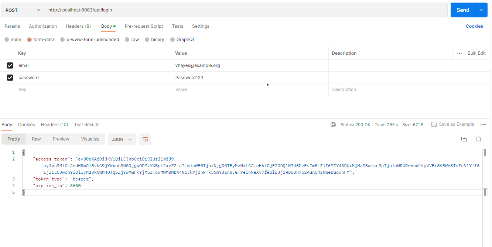

# Api_Liberfly

Teste em Laravel. 

```bash
php: 8.2
laravel: 10
```
## Iniciando

Clone o projeto, usando o comando abaixo (usando https):

```bash
git clone https://github.com/RuanSilva6721/api_liberfly.git
```

Depois de clonar, acesse o repositório e instale as dependências com os comandos abaixo (para isso, utilize o [composer](https://getcomposer.org/)):

```bash
cd supera_teste
composer install
```

Após instalar as dependências, duplique o arquivo `.env.example` e renomei um deles para `.env`.

Gere uma nova chave da aplicação:

```bash
php artisan key:generate
```

Altere as configurações no arquivo `.env` para que o projeto se conecte ao banco de dados.

Execute o comando abaixo para que as tabelas sejam criadas no banco de dados:

```bash
php artisan migrate
```


Inicie o servidor da aplicação com o comando:

```bash
php artisan serve
```
Para ver o projeto em execução acesse seu [http://localhost:8000](http://localhost:8000)

Caso queira dados fictícios para o seu usuário no banco:
```bash
php artisan db:seed --class=UserSeeder
```
Caso queria fazer o testes unitários:

```bash
php artisan test
```

**Caso queira rodar em docker , utilize o comando:**


##Inicie o docker em sua máquina e depois:
```bash
cd laradock
```
duplique o arquivo `.env.example` e renomei um deles para `.env`.
```bash
docker-compose up -d nginx mysql phpmyadmin
```
##
Para ver o projeto em execução acesse seu [http://localhost:8083](http://localhost:8083)

para acessar o phpmyadmin [http://localhost:1010](http://localhost:1010)
#acessar ao phpmyadmin
Sever: mysql
Username: root
Password: password

Você deve mudar a conexão do banco no `.env` para

DB_CONNECTION=mysql
DB_HOST=mysql
DB_PORT=3306
DB_DATABASE=api_liberfly
DB_USERNAME=root
DB_PASSWORD=password

Você deve acessar o workspace com o comando:

```bash
docker-compose exec --user=laradock workspace bash
```
Execute o comando abaixo para que as tabelas sejam criadas no banco de dados:
```bash
php artisan migrate
```

Caso queira dados fictícios para o seu usuário no banco:
```bash
php artisan db:seed --class=UserSeeder
```
Caso queria fazer o testes unitários:

```bash
php artisan test
```
**Autenticação com JWT:**
Gere uma nova chave da aplicação:

```bash
php artisan jwt:secret
```
acesse a rota passando o email e password como parâmetro para ter acesso ao token para poder acessar as rotas privadas
```bash
http://localhost:8083/api/login
```

acesse as rotas o token buscado anteriomente

```bash
http://localhost:8083/api/users
```
buscar todos os usuários

```bash
http://localhost:8083/api/id
```
buscar um usuário especifico 

## Construído com

* [Laravel](https://laravel.com/)

